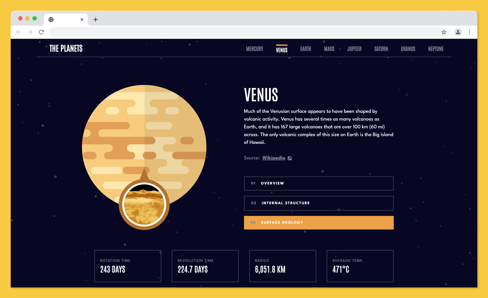

# Planets fact site

This is a solution to the [Planets fact site challenge on Frontend Mentor](https://www.frontendmentor.io/challenges/planets-fact-site-gazqN8w_f). Frontend Mentor challenges help you improve your coding skills by building realistic projects.

## Table of contents

- [Overview](#overview)
  - [The challenge](#the-challenge)
  - [Screenshot](#screenshot)
  - [Links](#links)
- [My process](#my-process)
  - [Built with](#built-with)
  - [Useful resources](#useful-resources)
- [Author](#author)

## Overview

### The challenge

Users should be able to:

- View the optimal layout for the app depending on their device's screen size
- See hover states for all interactive elements on the page
- View each planet page and toggle between "Overview", "Internal Structure", and "Surface Geology"

### Screenshot

### Links

- Solution URL: [https://github.com/ericnbello/planet-facts](https://github.com/ericnbello/planet-facts)
- Live Site URL: [https://planet-facts-ericnbello.netlify.app/](https://planet-facts-ericnbello.netlify.app/)

## My process

### Built with

- Semantic HTML5 markup
- CSS custom properties
- Flexbox
- CSS Grid
- Mobile-first workflow
- [React](https://reactjs.org/) - JS library
- [Tailwind](https://tailwindcss.com/) - CSS utility framework
- [React Router 6](https://reactrouter.com/) - 

### Useful resources

- [React Router 6](https://reactrouter.com/docs/en/v6/getting-started/tutorial) - This helped me become familiar with new features found in version 6. It's very thorough and I will continue to use it going forward.

## Author

- Website - [Eric Bello](https://www.ericnbello.com)
- Frontend Mentor - [@ericnbello](https://www.frontendmentor.io/profile/ericnbello)
- Twitter - [@ericnbello](https://www.twitter.com/ericnbello)
